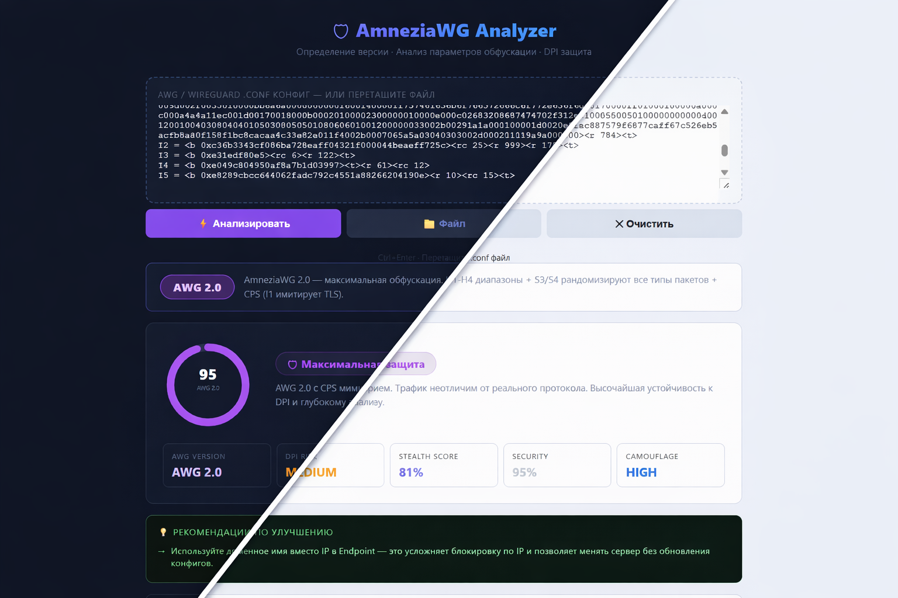

# 🛡 AmneziaWG Config Analyzer -
Лёгкий инструмент для анализа конфигураций AmneziaWG / WireGuard.
Проверяет параметры обфускации, устойчивость к DPI и общую безопасность VPN-конфигурации.

Работает полностью в браузере — без серверов и передачи данных.

  

---

🌐 Онлайн-тест

👉  [Открыть AmneziaWG Analyzer](https://pumbax.github.io/awg-analyzer/)

---

Возможности

- 🔍 Автоопределение версии
  
  - WireGuard
  - AWG 1.0
  - AWG 1.5
  - AWG 2.0

- 🧠 Анализ параметров
  
  - Junk packets ("Jc", "Jmin", "Jmax")
  - Handshake padding ("S1–S4")
  - Magic headers ("H1–H4")
  - CPS mimicry ("I1–I5")
  - Endpoint, MTU, DNS, AllowedIPs

- 📊 Оценка безопасности
  
  - Security Score
  - Stealth Score
  - DPI Detection Risk

- 💡 Автоматические рекомендации
  
  - исправление DNS leak
  - оптимизация параметров AWG
  - выявление ошибок конфигурации

---

Безопасность

Analyzer выполняет все вычисления локально.

- нет API-запросов
- нет отправки конфигураций
- нет внешних скриптов

Ваши PrivateKey и VPN-конфиги остаются в браузере.

---

Использование

1. Откройте анализатор
2. Вставьте ".conf" файл
3. Нажмите Analyze

или просто перетащите файл на страницу.

Ctrl + Enter → быстрый анализ

---

Для кого

- пользователи AmneziaWG
- администраторы WireGuard
- тестирование DPI обхода
- аудит VPN-конфигураций

---

License

MIT
